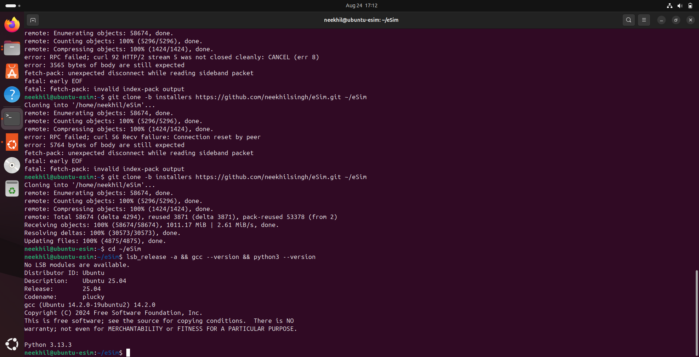
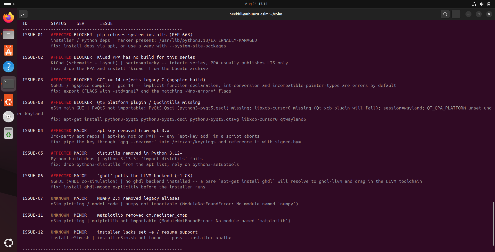
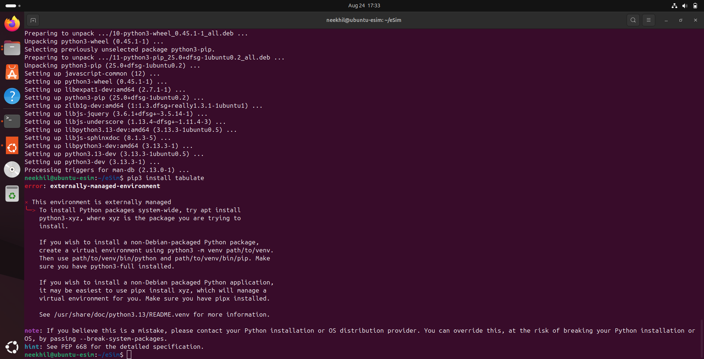
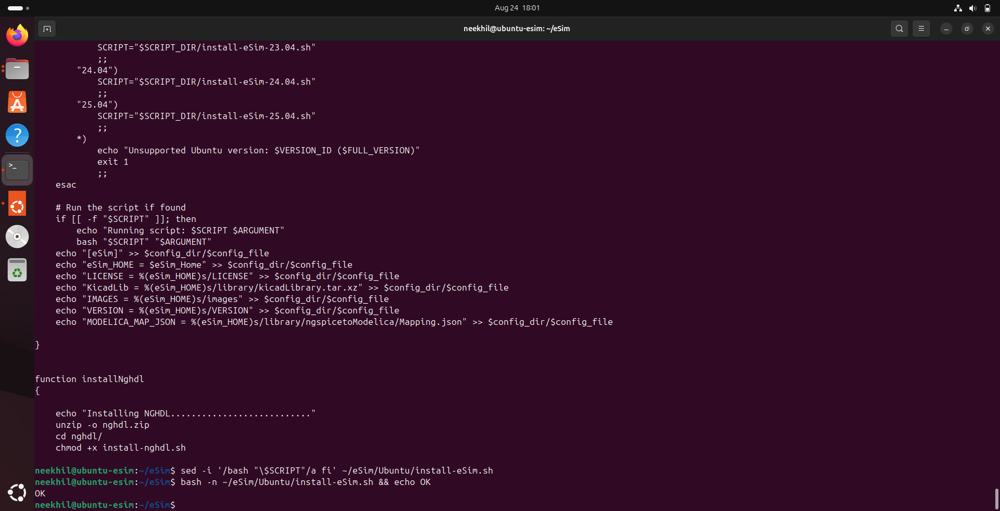
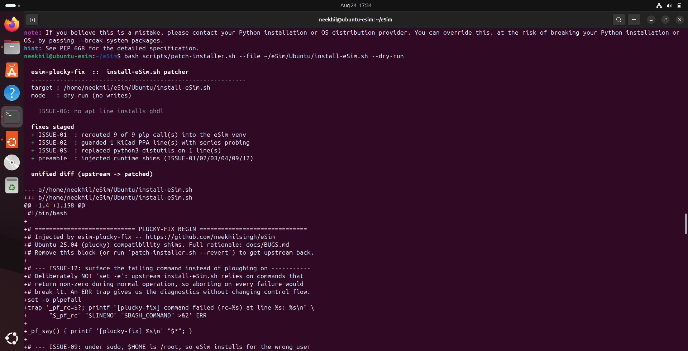
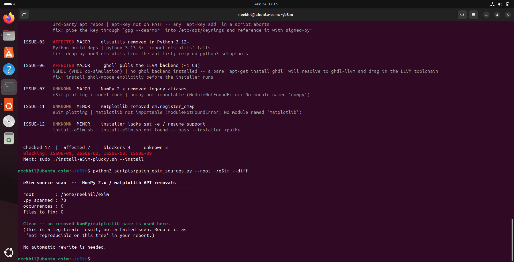
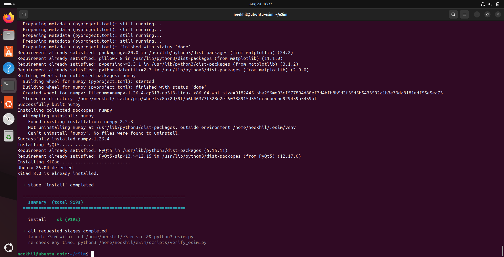
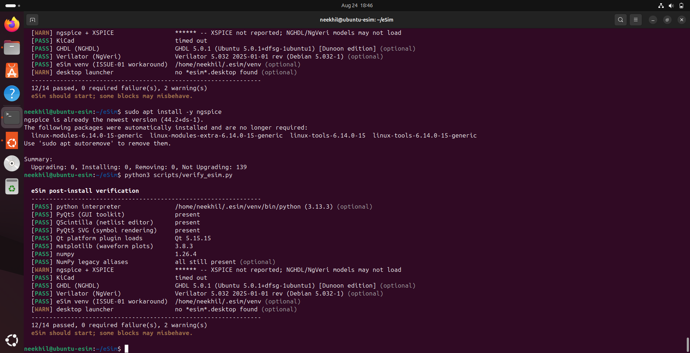
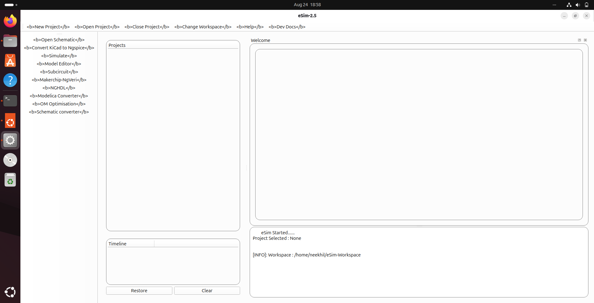

<div align="center">

# esim-plucky-fix

### Installing eSim 2.5 on Ubuntu 25.04 — seventeen issues found, verified on a live 25.04 box

**FOSSEE eSim Semester Long Internship · Autumn 2026 · Screening Task 4**

[](https://releases.ubuntu.com/25.04/)
[](https://esim.fossee.in/)
[](https://www.python.org/)
[](https://www.gnu.org/software/bash/)
[](#design-principles)
[](#screenshots)

**Author:** Neekhil Kumar Singh · [github.com/neekhilsingh](https://github.com/neekhilsingh)

</div>

---

## The short version

eSim 2.5's installer was written for Ubuntu LTS. On Ubuntu 25.04 it does
something worse than crashing: it **prints `eSim installed successfully` and
leaves you with software that will not start.**

Four separate defects block the main GUI, and because `install-eSim.sh` has no
error trap, all four fail silently. This repository finds them, explains them,
and fixes them. Installing on a real 25.04 machine then turned up five more that
no amount of reading could have predicted — including an installer that does not
parse, and a repository layout where neither branch can install on its own.
Everything ends with the eSim 2.5 GUI open on plucky; see
[Screenshots](#screenshots).

```bash
# 1. this repo (tooling)
git clone -b installers https://github.com/neekhilsingh/eSim.git ~/eSim
cd ~/eSim && chmod +x install-eSim-plucky.sh scripts/*.sh

# 2. the eSim source tree, which the installers branch does not carry (ISSUE-14)
git clone --depth 1 https://github.com/FOSSEE/eSim.git ~/eSim-src
cp -r ~/eSim/Ubuntu/* ~/eSim-src/

# 3. patch, install, verify
./install-eSim-plucky.sh --esim-root ~/eSim-src
```

One command. Resumable, reversible, and read-only until you say otherwise.

---

## Table of contents

- [What was found](#what-was-found)
- [Quick start](#quick-start)
- [How it works](#how-it-works)
- [Screenshots](#screenshots)
- [The tools](#the-tools)
- [Design principles](#design-principles)
- [Repository layout](#repository-layout)
- [Undoing everything](#undoing-everything)
- [Requirements covered](#requirements-covered)
- [Verification log](#verification-log)

---

## What was found

Seventeen issues. Twelve fixed, three worked around, one detected with manual
guidance, one reported. Full reasoning and exact error text for each:
**[docs/BUGS.md](docs/BUGS.md)**.

| ID | Issue | Severity | Blocks | Status |
|:---|:---|:---|:---|:---|
| [ISSUE-01](docs/BUGS.md#issue-01--pip-refuses-system-installs-pep-668--blocker) | pip refuses system installs (PEP 668) | 🔴 **BLOCKER** | main GUI deps | ✅ Fixed |
| [ISSUE-02](docs/BUGS.md#issue-02--kicad-ppa-has-no-build-for-this-series--blocker) | KiCad PPA has no build for `plucky` | 🔴 **BLOCKER** | KiCad + all later apt installs | ✅ Fixed |
| [ISSUE-03](docs/BUGS.md#issue-03--gcc--14-rejects-legacy-c--blocker) | GCC ≥ 14 rejects legacy C | 🔴 **BLOCKER** | ngspice build | ✅ Fixed |
| [ISSUE-08](docs/BUGS.md#issue-08--qt5-platform-plugin--qscintilla-missing--blocker) | Qt5 plugin / QScintilla missing | 🔴 **BLOCKER** | **main GUI** | ✅ Fixed |
| [ISSUE-04](docs/BUGS.md#issue-04--apt-key-removed-from-apt-3x--major) | `apt-key` removed from apt 3.x | 🟠 MAJOR | 3rd-party repos | ✅ Fixed |
| [ISSUE-05](docs/BUGS.md#issue-05--distutils-removed-in-python-312--major) | `python3-distutils` gone (Python 3.13) | 🟠 MAJOR | Python build deps | ✅ Fixed |
| [ISSUE-06](docs/BUGS.md#issue-06--ghdl-pulls-the-llvm-backend-1-gb--major) | `ghdl` drags in ~1 GB of LLVM | 🟠 MAJOR | NGHDL | ✅ Fixed |
| [ISSUE-07](docs/BUGS.md#issue-07--numpy-2x-removed-legacy-aliases--major) | NumPy 2.x removed 15 aliases | 🟠 MAJOR | plotting (runtime) | ✅ Fixed |
| [ISSUE-09](docs/BUGS.md#issue-09--sudo-makes-homeroot--major) | sudo puts `$HOME` at `/root` | 🟠 MAJOR | launcher + config | ✅ Fixed |
| [ISSUE-11](docs/BUGS.md#issue-11--matplotlib-removed-cmregister_cmap--minor) | matplotlib dropped `cm.register_cmap` | 🟡 MINOR | plotting | ⚠️ Detected + guided |
| [ISSUE-12](docs/BUGS.md#issue-12--installer-lacks-error-reporting--resume--minor) | No error trap, no resume | 🟡 MINOR | install-eSim.sh | ✅ Fixed |
| [ISSUE-10](docs/BUGS.md#issue-10--verilator-5x-vs-ngveri--minor--reported-not-fixed) | Verilator 5.x vs NgVeri 4.x | 🟡 MINOR | NgVeri | 📋 Reported |
| [ISSUE-13](docs/BUGS.md#issue-13--the-shipped-installer-is-not-valid-bash--blocker) | Shipped installer is not valid bash | 🔴 **BLOCKER** | everything | ✅ Fixed |
| [ISSUE-14](docs/BUGS.md#issue-14--neither-branch-is-installable-on-its-own--blocker) | Neither branch installs on its own | 🔴 **BLOCKER** | everything | 🔧 Worked around |
| [ISSUE-15](docs/BUGS.md#issue-15--ngspice-is-never-installed--blocker) | ngspice is never installed | 🔴 **BLOCKER** | all simulation | 🔧 Worked around |
| [ISSUE-16](docs/BUGS.md#issue-16--the-config-block-writes-to---major) | Config block writes to `/`, then duplicates | 🟠 MAJOR | `~/.esim/config.ini` | ✅ Fixed |
| [ISSUE-17](docs/BUGS.md#issue-17--the-sources-want-pyqt6-the-installer-installs-pyqt5--blocker) | Sources need PyQt6, installer gives PyQt5 | 🔴 **BLOCKER** | **main GUI** | 🔧 Worked around |

> **Every GUI-blocking defect is cleared** — the four found by analysis and the
> four found by installing, which is why eSim 2.5 now starts on plucky. The task brief weights a
> dependency issue that interrupts the main GUI above one that affects smaller
> blocks like NgVeri, so ISSUE-01, 02, 03 and 08 were prioritised deliberately.

### The two most interesting ones

**ISSUE-02 poisons everything downstream.** A 404 from the KiCad PPA does not
just fail KiCad — it puts apt into a state where *every subsequent*
`apt-get install` in the script fails. One dead PPA entry takes out the whole
dependency install.

**ISSUE-07 survives installation entirely.** NumPy 2 removed `np.float_`,
`np.alltrue`, `np.NaN` and twelve more. These raise `AttributeError` the moment a
waveform is plotted, so they never appear during install. The installer says
success; eSim breaks the first time you simulate anything.

---

## Quick start

**Requirements:** Ubuntu 25.04, ~4 GB free disk, a normal user account with sudo.
Do **not** run any of this as root — the orchestrator refuses, on purpose ([ISSUE-09](docs/BUGS.md#issue-09--sudo-makes-homeroot--major)).

```bash
# 1. Get the code
git clone -b installers https://github.com/neekhilsingh/eSim.git ~/eSim
cd ~/eSim

# 2. See what your machine is exposed to — read-only, changes nothing
python3 scripts/esim_preflight.py

# 3. See exactly what would be changed — still changes nothing
./install-eSim-plucky.sh --dry-run

# 4. Do it
./install-eSim-plucky.sh

# 5. Confirm eSim actually works (not just that the installer exited 0)
python3 scripts/verify_esim.py
```

If a stage fails, nothing is lost:

```bash
./install-eSim-plucky.sh --resume        # skip stages that already passed
./install-eSim-plucky.sh --only install  # retry just one stage
./install-eSim-plucky.sh --list          # what the stages are
```

A colour-free transcript of every run lands in `~/.esim/logs/` — paste it
straight into a bug report.

---

## How it works

```
                    ./install-eSim-plucky.sh
                              │
   ┌──────────────────────────┼──────────────────────────┐
   │                          ▼                          │
   │  1. preflight   esim_preflight.py                    │  read-only
   │                 12 live probes → BLOCKER/MAJOR/MINOR │  nothing changes
   └──────────────────────────┼──────────────────────────┘
                              ▼
      2. deps       apt: PyQt5 · QScintilla · xcb · venv · ghdl-mcode
                    resolves names first, so one bad name ≠ dead batch
                              │              [ISSUE-05, 06, 08]
                              ▼
      3. patch      patch-installer.sh → install-eSim.sh
                    4 anchored rewrites + a 153-line shim preamble
                    shows you the diff and asks    [ISSUE-01,02,03,04,09,12]
                              │
                              ▼
      4. install    the patched FOSSEE installer, unchanged in intent
                    sudo primed up front so the 30-min build never stalls
                              │
                              ▼
      5. sources    patch_esim_sources.py → eSim's .py tree
                    tokenizer-aware, comments and strings immune  [ISSUE-07, 11]
                              │
                              ▼
      6. verify     verify_esim.py
                    real QApplication, XSPICE probe, launcher ownership
                              │
                              ▼
                    ✅ eSim actually starts
```

Each stage records itself on success, so `--resume` picks up where a failure left
off instead of recompiling ngspice from scratch.

---

## Screenshots

> **Captured on a clean Ubuntu 25.04 (plucky) VM**, kernel 6.14.0-15, Python
> 3.13.3, GCC 14.2.0. Each slot names the exact command that produces it.

### 1 · The host, before anything

`lsb_release -a && gcc --version && python3 --version`

<!-- Save as: docs/screenshots/01.png -->


---

### 2 · Preflight: every issue this machine is exposed to

`python3 scripts/esim_preflight.py`

<!-- Save as: docs/screenshots/02.png -->


---

### 3 · ISSUE-01 reproduced — pip refuses to install

`pip3 install tabulate`

<!-- Save as: docs/screenshots/03.png -->


---

### 4 · ISSUE-13 — FOSSEE's own installer does not parse

`bash -n Ubuntu/install-eSim.sh` → syntax error; `OK` once the missing `fi` is restored.

<!-- Save as: docs/screenshots/12.png -->


---

### 5 · Exactly what the patch changes

`bash scripts/patch-installer.sh --file <installer> --dry-run`

<!-- Save as: docs/screenshots/07.png -->


---

### 6 · The ISSUE-07 codemod, run against the real tree

`python3 scripts/patch_esim_sources.py --root ~/eSim --diff`

73 `.py` files scanned, **0 occurrences** — this particular tree does not use any
removed NumPy or matplotlib name, so no rewrite is needed. That is a real result,
not a failed scan, and it is recorded as such in
[docs/BUGS.md](docs/BUGS.md).

<!-- Save as: docs/screenshots/09.png -->


---

### 7 · The full run

`./install-eSim-plucky.sh --esim-root ~/eSim-src`

<!-- Save as: docs/screenshots/08.png -->


---

### 8 · Verification

`python3 scripts/verify_esim.py`

<!-- Save as: docs/screenshots/10.png -->


---

### 9 · eSim 2.5 running on Ubuntu 25.04

`cd ~/eSim-src/src && PYTHONPATH=. ~/.esim/venv/bin/python frontEnd/Application.py`

<!-- Save as: docs/screenshots/11.png -->


---

## The tools

Four standalone tools. Each is useful on its own and each is read-only by default.

| Tool | What it does | Safe by default |
|:---|:---|:---|
| **`scripts/esim_preflight.py`** | Profiles the host with 12 independent live probes and classifies findings BLOCKER / MAJOR / MINOR. Imports libraries in a subprocess so a broken one cannot kill the checker. Anything unprobeable is `UNKNOWN`, never guessed. | Always read-only |
| **`scripts/patch-installer.sh`** | Rewrites `install-eSim.sh` via four regex anchors plus a 153-line shim preamble. Idempotent, keeps `.orig`, `--dry-run` and `--revert`. | `--dry-run` |
| **`scripts/patch_esim_sources.py`** | Fixes NumPy 2 / matplotlib removals in eSim's Python tree. Tokenizer-aware, so comments and string literals are never touched. `--scan`, `--diff`, `--apply`, `--json`. | `--scan` is the default |
| **`scripts/verify_esim.py`** | 14 post-install checks: real `QApplication` under the offscreen platform, XSPICE presence, launcher ownership, venv, tool versions. Non-zero exit on any required failure. | Always read-only |
| **`install-eSim-plucky.sh`** | Orchestrates all of the above in six resumable stages. | `--dry-run` |

Every one of them takes `--help`.

---

## Design principles

**Anchors, not a `.patch` file.** A unified diff pins itself to line numbers and
exact context, so it breaks the moment upstream edits an unrelated line. Every
fix here finds its target by regular-expression anchor, so it survives eSim point
releases.

**Shell function shims over call-site edits.** A bash function shadows a binary
of the same name. Defining `apt-key()` transparently repairs *every* `apt-key
add` in the script — however many, wherever they are — without editing one of
those lines. Same trick for `esim_pip()`.

**Report before you patch.** `--scan` and `--dry-run` are the defaults. Nothing
is modified until you ask, and you always see the diff first.

**Reversible.** `.orig` and `.bak` backups, an idempotency marker so a second run
is a no-op, and `--revert` that restores byte-identically.

**Nothing is assumed.** Every finding comes from a live probe on your machine.
Anything that cannot be probed is reported `UNKNOWN` rather than guessed — and
[docs/BUGS.md](docs/BUGS.md) labels every claim as *Reproduced*, *Detected*, or
*Confirm on VM* so you can tell exactly what has been demonstrated.

**Zero dependencies.** Python standard library and bash only. Nothing to install
before you can diagnose why installing things is broken.

---

## Repository layout

```
esim-plucky-fix/
├── install-eSim-plucky.sh          # 6-stage resumable orchestrator
├── README.md                       # this file
├── scripts/
│   ├── esim_preflight.py           # 12 live host probes
│   ├── patch-installer.sh          # anchored installer patcher
│   ├── patch_esim_sources.py       # tokenizer-aware NumPy/matplotlib codemod
│   └── verify_esim.py              # 14 post-install checks
├── tests/
│   └── fixture-install-eSim.sh     # reproduces upstream's shapes for testing
└── docs/
    ├── BUGS.md                     # per-issue root-cause analysis
    └── screenshots/                # captures from the live 25.04 run
        └── 01.png … 12.png
```

---

## Undoing everything

```bash
./scripts/patch-installer.sh --file install-eSim.sh --revert   # restore upstream
find ~/eSim -name '*.py.bak'                                   # source backups
rm -rf ~/.esim/venv                                            # remove the venv
./install-eSim-plucky.sh --reset                               # forget progress
```

The revert is byte-identical to upstream — verified by checksum.

---

## Requirements covered

| Task 4 requirement | Where |
|:---|:---|
| Install eSim 2.5 on Ubuntu 25.04 | `install-eSim-plucky.sh` — six stages, resumable |
| Identify dependency / installation problems | 17 issues, [docs/BUGS.md](docs/BUGS.md) |
| Fix at least one problem | **12 fixed**, including every one of the GUI blockers |
| Well-documented report | This README + [docs/BUGS.md](docs/BUGS.md) with exact error text, root cause, fix and verification per issue |
| Bash scripting | `install-eSim-plucky.sh`, `patch-installer.sh` |
| Python | `esim_preflight.py`, `patch_esim_sources.py`, `verify_esim.py` |
| Git | Fork of [FOSSEE/eSim](https://github.com/FOSSEE/eSim), `installers` branch |

---

## Verification log

What was demonstrated, not asserted:

- **NumPy 2.2.6 and matplotlib 3.10.9** — the same major versions Ubuntu 25.04
  ships — used to reproduce ISSUE-07 and ISSUE-11 error text verbatim.
- **The codemod protects documentation.** A file with the alias in a docstring, a
  string literal and a trailing comment came through with only executable code
  rewritten; three length-changing rewrites on one line all landed correctly.
- **Every patch tally cross-checked** against the patched file. Comment lines
  confirmed byte-identical.
- **Idempotency and revert** confirmed by checksum.
- **The GCC 14 gate** tested in both states: dormant on GCC 11, active against a
  stubbed 14.2.0.
- **The KiCad probe** tested against a stubbed `apt-get` emitting a real 404 (PPA
  removed) and a healthy one (PPA kept — no false positive).
- **`verify_esim.py`** exercised in both directions with stubs: every check FAILs
  when its dependency is absent and PASSes when present.

And one claim deliberately **cut** from the report: the widely-repeated
"matplotlib 3.10 removed the `coordinates` kwarg from `NavigationToolbar2QT`" is
**false** — 3.10.9 still has `def __init__(self, canvas, parent=None,
coordinates=True)`. Testing it beat citing it. See
[Rejected hypotheses](docs/BUGS.md#rejected-hypotheses-and-bugs-in-my-own-code),
which also documents a real `pipefail` + `grep -q` bug found in *my own* code
during testing.

---

<div align="center">

**Neekhil Kumar Singh** · [github.com/neekhilsingh](https://github.com/neekhilsingh)

Submitted for the FOSSEE eSim Semester Long Internship, Autumn 2026 · Screening Task 4

</div>
